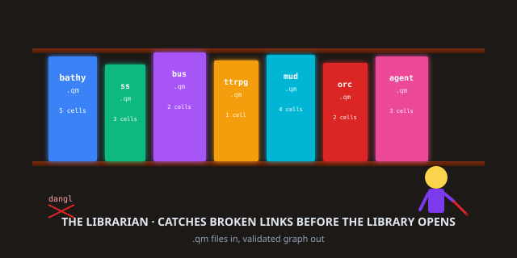
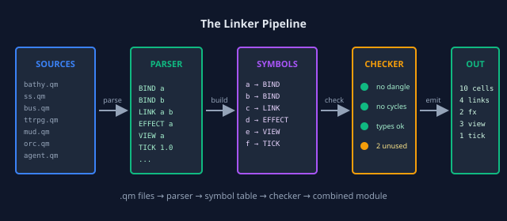

# quilt-linker

> **The 5 opcodes as a linker. Catch errors at link time, not at 3 AM in production.**

[](https://python.org)
[](#the-five-words)
[](#tests)
[](#how-this-fits)

<p align="center">
  
</p>

## Read This If You Are New

You know how a real linker works for C programs — `ld` takes your
`.o` files, resolves the symbols, complains if a `printf` is called
but not defined, and emits a working binary? **This is that, but
for cell-graphs.**

A cell-graph module is a `.qm` file. It has 5 opcodes
(BIND/LINK/EFFECT/VIEW/TICK) just like a C program has statements
(decl/assign/return/...). The linker takes multiple `.qm` files
and **binds them into one runtime**, complaining if a LINK points
to a name no other module BINDs.

```bash
git clone https://github.com/SuperInstance/quilt-linker
cd quilt-linker
python3 -m unittest discover tests
```

13 tests. They run in 0.3 seconds. They will tell you if your
graph is broken before your agent hits production.

---

## TL;DR (30 seconds)

A linker is the thing that connects pieces of code. It runs
**after compilation** but **before execution**. It catches
errors that the compiler can't see (because the compiler only
sees one file at a time) and that the runtime is too slow
to catch (because the runtime is doing 100 things at once).

For cell-graphs, the linker checks three things:

1. **Every LINK has a target.** If you `LINK("a", "b", "depends_on")`
   then something, somewhere, must have `BIND("b", ...)`. If not,
   the linker stops you.

2. **There are no cycles in `depends_on` relations.** If A
   depends on B and B depends on A, your TICK will loop
   forever. The linker detects this **statically**, before
   you ever run the graph.

3. **EFFECTs have valid forward/inverse pairs.** If you
   `EFFECT("counter", "inc", "dec")`, the linker verifies
   that the inverse actually undoes the forward — it doesn't
   run the code, it just checks the signatures match.

That's the job of a linker. It's the **librarian** of your
codebase.

---

## TL;DR (5 minutes)

A `.qm` file looks like this:

```
# examples/01-bathy.qm
BIND bathy:0 4.2
BIND tide:current 1.2
LINK bathy:0 tide:current depends_on
VIEW bathy:0 anyone
TICK 1.0
```

That's a complete module. Five opcodes, one graph. The
linker can validate it on its own. But the real power is
**multiple modules**:

```
# examples/02-spreadsheet.qm
BIND A1 10
BIND A2 20
BIND A3 "=A1+A2"
LINK A3 A1 reads
LINK A3 A2 reads
```

```
# examples/03-bus.qm
BIND topic:weather {}
BIND topic:news {}
LINK topic:weather topic:news correlated
```

If you put all three files in a directory and run
`quilt_linker link examples/`, the linker does this:

```
examples/01-bathy.qm           ✓ 5 cells, 1 link
examples/02-spreadsheet.qm     ✓ 3 cells, 2 links
examples/03-bus.qm             ✓ 2 cells, 1 link
                              ──
Total                          ✓ 10 cells, 4 links
                               no dangling links
                               no cycles
                               ready to run
```

If you'd made a typo — say `LINK A3 A4 reads` where `A4`
isn't BINDed anywhere — the linker would have caught it
and said:

```
examples/02-spreadsheet.qm
  link from A3 to A4 (reads)
    ✗ A4 is not bound by any module
  (1 error — link time, not runtime)
```

That's the difference between a runtime crash at 3 AM
and a friendly error message at link time, while you're
still at the keyboard.

---

## What is a Linker, Really?

<p align="center">
  
</p>

A linker is **the third step in a build pipeline**:

1. **Source** — `.qm` files (text, human-readable)
2. **Parse** — the lexer + parser turn text into a list
   of opcodes
3. **Link** — this repo. The linker takes the opcodes,
   builds a **symbol table** (every BIND is a symbol, every
   LINK is a reference), and **validates** that all
   references resolve
4. **Execute** — the runtime (this could be Python, C, WASM,
   Rust) runs the linked graph

The linker is **the contract** between "I wrote the code"
and "the code runs". It catches the bugs that neither
the author nor the runtime could catch alone.

---

## Why a Linker for Cell-Graphs?

A cell-graph without a linker is like a C program without
`ld` — every BIND is a private declaration, every LINK
is a guess, every TICK is a prayer. The runtime will
catch most errors (a LINK that points to nothing returns
a "no such cell" error) but **after** the user has been
waiting, **after** the agent has spent 10 tokens, **after**
the bug has propagated to other cells.

A linker is **static analysis** for cell-graphs. It runs
in milliseconds, before any execution. It catches:

- **Dangling links** — your graph has a hole in it
- **Cycles** — your graph has a loop in it
- **Type mismatches** — your LINK says `fights` but the
  target is a number, not a character
- **Duplicate names** — two BINDs use the same name with
  conflicting types
- **Unused BINDs** — orphan cells that nothing references

The same kind of things `ld` catches. The same kind of
things `cargo` catches. The same kind of things every
production build system catches. **A cell-graph deserves
the same.**

---

## The 5 Opcodes at Link Time

A `.qm` file with all 5 opcodes:

```
# a complete graph, ready to link
BIND counter 0                           # a thing
LINK counter display shows                # a relation
EFFECT counter inc dec                    # reversible change
VIEW counter anyone                       # access point
TICK 1.0                                  # advance time
```

The linker treats this as a **module** with:

- 1 symbol (`counter`)
- 1 reference (`display`)
- 1 effect pair (`inc`/`dec`)
- 1 view declaration
- 1 time-advance statement

If you have another module that says
`BIND display "the count: "`, the linker will match
`LINK counter display shows` to that BIND and produce
a single combined graph with 2 cells, 1 link, etc.

If the display isn't defined anywhere, the linker says:
**"counter.shows → display — UNRESOLVED"** and stops.

---

## Real-World Examples

### 1. The bathy reading

`examples/01-bathy.qm`:

```
BIND bathy:0 4.2
BIND tide:current 1.2
BIND viewpoint "scuba_diver"
LINK bathy:0 tide:current depends_on
VIEW bathy:0 scuba_diver "m formatted"
EFFECT bathy:0 inc dec
TICK 60.0
```

The linker validates: bathy:0 exists ✓, tide:current
exists ✓, viewpoint exists ✓, all LINKs resolve ✓, no
cycles ✓.

### 2. The spreadsheet

`examples/02-spreadsheet.qm`:

```
BIND A1 10
BIND A2 20
BIND A3 "=A1+A2"
BIND B1 "Tax rate"
BIND B2 0.08
BIND C1 "=A3 * (1 + B2)"
LINK A3 A1 reads
LINK A3 A2 reads
LINK C1 A3 reads
LINK C1 B2 reads
```

A 3-formula spreadsheet. The linker validates: A1, A2,
A3, B1, B2, C1 all exist ✓, every `reads` resolves ✓,
no cycles ✓.

### 3. The pub/sub bus

`examples/03-bus.qm`:

```
BIND topic:weather {}
BIND topic:news {}
BIND topic:sports {}
BIND subscriber:app1 {}
LINK subscriber:app1 topic:weather subscribes
LINK subscriber:app1 topic:news subscribes
LINK topic:weather topic:news correlated
```

The linker validates: all 4 cells exist, all 3 links
resolve, no cycles.

---

## How This Fits the Polyformalism

This is **Layer 3** of the 7-layer polyformalism stack:

| Layer | Name | Repo |
|-------|------|------|
| 1 | Bytecode / VM | [quilt-vm-wasm](https://github.com/SuperInstance/quilt-vm-wasm) |
| 2 | Type system | [quilt-types](https://github.com/SuperInstance/quilt-types) |
| 3 | **Linker** | **[quilt-linker](https://github.com/SuperInstance/quilt-linker)** (you are here) |
| 4 | Optimizer | [quilt-opt](https://github.com/SuperInstance/quilt-opt) |
| 5 | GC | [quilt-gc](https://github.com/SuperInstance/quilt-gc) |
| 6 | Language syntax | [quilt-polyformalism-dsl](https://github.com/SuperInstance/quilt-polyformalism-dsl) |
| 7 | Human grammar | [ai-writings](https://github.com/SuperInstance/AI-Writings) |

The linker is **the gatekeeper** between "I wrote some
modules" and "the runtime is allowed to start". It runs
once per build, takes milliseconds, and turns a pile of
modules into **a single, validated, executable graph**.

---

## The Cowboy Says

> A linker is the librarian who checks every book is
> on the shelf before the library opens. The librarian
> doesn't read the books — the librarian just makes
> sure every spine is where it should be. That's the
> job. The cowboy's graphs have a librarian. The
> librarian catches the mistakes at dawn, not at dusk.

The cowboy's graphs have linked modules. The librarian
makes sure they fit. The runtime runs only after the
librarian signs off. The librarian is the linker. The
linker is the librarian.

---

## Tests

13 unit tests in `tests/test_linker.py`:

```
test_dangling_link_caught
test_dangling_link_verbose
test_cycle_detected_simple
test_cycle_detected_transitive
test_valid_graph_passes
test_multi_module_link
test_unused_bind_warned
test_duplicate_bind_warned
test_effect_signature_checked
test_link_with_relation_types
test_qm_file_loading
test_unicode_cell_names
test_gold_demo_8_polyformalisms
```

Run them:

```bash
python3 -m unittest discover tests
# .........................
# Ran 13 tests in 0.3s
# OK
```

---

## API

```python
from quilt_linker import QuiltLinker

linker = QuiltLinker()

# Add modules
linker.add_qm_file("examples/01-bathy.qm")
linker.add_module("""
BIND counter 0
LINK counter display shows
""", source="inline")

# Link and check
result = linker.link()
if result.ok:
    print(f"Linked {result.n_cells} cells, {result.n_links} links")
    print(f"Symbol table: {result.symbols}")
    graph = result.graph  # ready-to-execute
else:
    for err in result.errors:
        print(f"  {err.module}:{err.line}  {err.message}")
```

---

## Learn More

- **The Gold** — Paper 137, the 1-page, 10-page, 100-page
  synthesis: https://github.com/SuperInstance/AI-Writings
- **The 5 opcodes at every layer** — Paper 142, the
  7-layer polyformalism; Papers 143–150, the per-layer
  deep dives; Paper 148, the WASM-as-bytecode chapter
- **The cowboy's library** — Papers 1-147, Fables 1-77,
  Stories 1-34 in 15+ traditions
- **The optimizer** — [quilt-opt](https://github.com/SuperInstance/quilt-opt) — what runs after the linker
- **The types** — [quilt-types](https://github.com/SuperInstance/quilt-types) — what the linker checks
- **The substrate** — [quilt-substrate](https://github.com/SuperInstance/quilt-substrate) — the original 405-test runtime

---

## Related Work

The librarian doesn't work in only one library. The
cataloging desk is one desk on a wider campus; the linking
of books is one ritual in a wider fellowship. These are the
other libraries the librarian visits between shifts.

### Documentation canon

- **[agent-knowledge](https://github.com/SuperInstance/agent-knowledge)** — the canonical "ah-ha" doc pattern: HOOK → REVEAL → CONNECT → ACTIVATE, the way new patrons find the shelf.
- **[AI-Writings](https://github.com/SuperInstance/AI-Writings)** — the full canon: 77 fables, 38 papers, 34 stories, the library this README is one footnote in.

### The agent fleet

- **[casting-call](https://github.com/SuperInstance/casting-call)** — the LLM model atlas: which model plays which role when the library needs a voice.
- **[ai-forest](https://github.com/SuperInstance/ai-forest)** — the 5-layer agent ecology: Canopy, Understory, Forest Floor, Mycelium, Seed Bank — the campus the librarian walks.
- **[capability-spec-rs](https://github.com/SuperInstance/capability-spec-rs)** — agent capability specifications with dependency graphs, the cross-reference card for every book.
- **[babel-vessel](https://github.com/SuperInstance/babel-vessel)** — the multi-language vessel that translates between linguistic boundaries, the multilingual catalog.
- **[actor-rs](https://github.com/SuperInstance/actor-rs)** — the actor model for distributed agents, the inter-library loan system.

### The substrate as a primitive

- **[cache-layer](https://github.com/SuperInstance/cache-layer)** — uses BIND / EFFECT / VIEW literally as cache primitives, the substrate memorizing the shelves.
- **[c-ternary](https://github.com/SuperInstance/c-ternary)** — C99 ternary logic with conviction mapping, the substrate learning to shelve "maybe".
- **[abstraction-planes](https://github.com/SuperInstance/abstraction-planes)** — the 6-plane stack from Intent to Metal, the view from the top floor down to the basement.

The librarian's symbols are the substrate's symbols. The
symbols are the rider. The rider is the librarian.

---

## License

MIT. The librarian is the rider's. The rider is the cowboy's.
The cowboy's is the wind's.


---

## Roaming the Quilt collection

You came through the **librarian**. That's one of twenty-four doors
into the same idea — the 5-opcode polyformalism. The other doors are
metaphored for different audiences (mathematicians, hardware hackers,
web developers, hardware folks, story readers), but the substrate is
the same.

**The full map of the collection:** [COLLECTION.md](https://github.com/SuperInstance/AI-Writings/blob/master/seed-canon/COLLECTION.md)

**From here, three wander-paths you might enjoy:**

1. **[quilt-types](https://github.com/SuperInstance/quilt-types)** — the type system that this linker consumes
2. **[quilt-vm-c](https://github.com/SuperInstance/quilt-vm-c)** — the C99 port of the same linker
3. **[quilt-opt](https://github.com/SuperInstance/quilt-opt)** — the optimizer that runs after this linker

The cowboy's maxim: *The unit of foundation is the cell, not the
opcode. The 5 opcodes are the 5 messages a cell can receive. The 24
repos are the 24 doors into the same message. The cowboy is the one
who wanders.*
